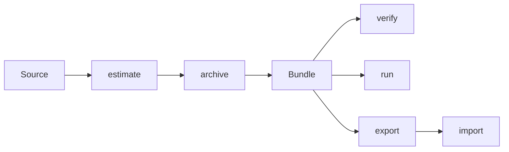

# Concepts

darsay is small once the objects are named. This page is the naming.

A vault is a folder of bundles. A bundle is a pinned snapshot whose payload
never changes. The manifest records facts and leaves blanks as blanks. **A
catalog is a curated list of sources; the vault is that list, realized.**
You load `model/` (or `data/`) the way you would load the original repo.

Have not run it yet? [Start here](/docs/getting-started/) first — five minutes,
then come back. The ideas land harder after you have a bundle on disk.

## Vault

A vault is a directory of bundles. Default: `~/darsay`. Override with
`--vault` or `$DARSAY_HOME`. `--vault` may come before or after the
subcommand.

```
vault/
├── qwen--qwen3-0.6b/<rev>/          # a model bundle
├── datasets--rotten_tomatoes/<rev>/ # a dataset bundle
├── catalogs/summer/                 # a catalog (want-list; no payload)
├── config.toml                      # optional: this vault's operator settings
└── .runtime/                        # disposable inference envs (not archival)
```

There is no hidden database. `darsay list` is a walk of this tree — the
vault as a catalog view (STATUS, SOURCE, HAVE). `list CATALOG` overlays a
want-list on the same vault. `list --json` is the script surface (paths,
licenses). `info` / `run` / `verify` accept a path, a bundle id, or a
unique prefix. `darsay du` is disk use of bundles and `.runtime` only
(catalog JSON is curator data, not payload). `darsay rm` deletes a bundle.
The vault is yours to rsync, restic, or put on a shelf. rsync is a
first-class copy: the next `archive` / `assemble` / `assemble --move`
trusts dest files the ledger already marks verified (size match), fetches
only what is still missing, and rewrites metadata. It does not re-download
the majority, and it does not pull dest back over SMB to re-hash a copy.
[Incremental transfer](/docs/incremental/#1-why-this-can-beat-rsync-at-fetching--and-why-rsync-still-copies-disks).

`config.toml` is operator preference, not archival fact — for example the
free-space floor an archive pauses at, a bandwidth cap, or how long to
wait for a lost network. A vault-level file travels with an
archive drive; `~/.config/darsay/config.toml` applies to every vault on a
machine. `darsay config` shows what applies and why.
[Incremental transfer](/docs/incremental/#6-session-budgets).

## Catalog

A catalog is a curated list of sources — desire, notes, cached sizes —
before any payload exists. The vault is that list, realized: `darsay list
summer` overlays the catalog on *this* vault (have / partial / want).
`archive` does not rewrite the file. Share `catalog.json` (or the
directory); a friend overlays it against their vault.

```
darsay catalog new summer
darsay catalog add summer huggingface:Qwen/Qwen3-0.6B --desire 9
darsay list summer
darsay archive --next summer
```

Field-by-field: [Catalogs](/docs/catalogs/). Cookbook:
[Share a catalog](/docs/examples/#share-a-catalog).

## Bundle

A bundle is **one pinned revision of one source**, stored so it is both
a museum record and a working checkout.

```
vault/<name>/<revision12>/
├── model/            # or data/ — the immutable payload
├── manifest.json     # recorded facts (the source of truth)
├── README.md         # generated from the manifest (`darsay regen`)
├── curation.md       # the only file you write by hand
└── LICENSE           # upstream license, surfaced at the root
```

Four parts, always:

| Part | Role | Mutability |
|---|---|---|
| Payload (`model/` or `data/`) | Byte-exact snapshot of upstream | Frozen after archive |
| `manifest.json` | What was established, never guessed | Tool may add facts; never fabricates |
| Generated views (`README.md`, `VERIFICATION.md`) | Human-readable projections | Regenerated |
| `curation.md` | Your notes | Yours; never overwritten once it exists |

The **bundle hash** covers the payload only. Tool-written state at the
bundle root can change without the archive “changing.”

## Pin

`archive` does not mean “download `main`.” It means:

1. Resolve the ref (`main`, a tag, a commit) to an **immutable revision**.
2. Freeze the file set for that revision. For a model this is the
   **masters-first selection** by default: the irreplaceable weights,
   everything darsay cannot classify, and all support files —
   mechanically derivable prints are skipped on the record
   ([Quantization §4](/docs/quantization/#mechanics); `--full` freezes the
   whole repo, `--include` freezes exactly what you say).
3. Transfer those files, and only those files, until every one verifies.

Rerunning `archive` on the same source continues *that pin* — the same
files, the same selection, no re-classification. It does not chase a
moving `main` or a moving rule set. To take a new snapshot, `--force`
pins again.

That is why resume works without a special subcommand, and why a 50 GB
job can be ten evenings of `--max-gb 10`.

A **skeleton** is a partial pin whose verified bytes have been handed to
another vault (`assemble --move`): the pin and every recorded hash stay,
the payload does not. It is how one pin crosses two disks that never mount
together — fetch a half where there is bandwidth, hand it to the disk with
the room, then fetch the rest without re-downloading what you carried over.
The next `archive` fetches only what no vault has yet.
[Incremental transfer](/docs/incremental/#across-disks-assemble---move-and-skeletons).

## Payload vs metadata

This distinction is the whole design.

- **Payload** — the files a loader needs. Never rewritten. Copied,
  hashed, verified, exported. For models, `model/` is a pristine Hub
  snapshot: `transformers` loads it as a local directory. For datasets,
  `data/` is the same idea for parquet/jsonl/csv.
- **Metadata** — `manifest.json` and the sibling reports. The tool owns
  these. They record facts (hashes, license text, parameter counts from
  safetensors headers, Hub tags *at archive time*). Unknown is `null`.
  Query caps are recorded, never silently truncated.

If a number is not in the payload and not returned by upstream, it is
not in the manifest. Curators fill gaps in `curation.md`.

## Dry run

Every command that writes takes `-n` / `--dry-run`. It runs the same checks
(and gives the same refusals), prints the same report in the conditional —
`Would remove:`, `Would import …`, `Would assemble into …` — writes nothing,
and ends with the real command to paste:

```
$ darsay rm qwen--qwen3-0.6b -n
Would remove:
     1.5 GiB  ~/darsay/qwen--qwen3-0.6b/c1899de289a0
Dry run: nothing removed. To remove:
  darsay rm qwen--qwen3-0.6b
```

`archive --dry-run` is the one preview that records something: a new source
is pinned (`transfer.json`, no payload bytes) so the plan it printed is the
plan the real run continues. `estimate` is the preflight that writes nothing
at all.

## The loop



| Verb | What it does | What it does not do |
|---|---|---|
| `estimate` | Read-only preflight from source metadata | Download, write, guess |
| `archive` | Pin, transfer, hash, register | Mutate an already-registered payload |
| `verify` | Re-hash payload vs manifest | Repair files |
| `run` | Hydrate an env, infer offline | Touch `model/` |
| `export` | Pack a deterministic `.mvb.tar` | Include machine-local logs |
| `import` | Unpack, re-hash, then register | Trust the tar without checking |

`hydrate` is the explicit form of what `run` does first.
`dehydrate` / `envs --prune` throw away runtimes, never archives.

## Record, don't fabricate

The Hub will lie to a future reader by vanishing. The manifest must not
lie in the other direction by filling blanks.

- Established from upstream or the payload → recorded.
- Not established → `null`.
- A listing that stopped at a query cap → the cap is stored
  (`query_limit`), and the list is marked incomplete.

This is why a bundle remains interpretable without darsay: a 2040 reader
opens `manifest.json` and [MANIFEST.md](/docs/manifest/), and knows which
fields are facts.

## Hydration is disposable

Inference needs torch, or llama-cpp, or whatever the payload's format
implies. Those packages are large, versioned, and not archival.

So they do not live in the bundle. They live under
`<vault>/.runtime/envs/`, content-keyed, shared across bundles with the
same needs. `hydration.json` at the bundle root is a pointer plus a run
log. Delete it. The next `run` rebuilds. The payload is still there.

A passing `run` is evidence: it executed with `HF_HUB_OFFLINE=1`. The
archived bytes were sufficient. Details: [Hydration](/docs/hydration/).

## Formats outlive the tool

Museum-grade does not mean “hope this CLI still runs.” Longevity sits in
two boring formats:

- **`manifest.json`** — plain JSON, `kind: darsay.bundle`, field-by-field
  spec in [MANIFEST.md](/docs/manifest/). Unknown fields are ignored on read
  and preserved on write. Major-newer is a hard error.
- **`.mvb.tar`** — uncompressed tar, marker first, frozen
  `darsay-verify.py` (stdlib only), deterministic metadata, unpackable
  with stock `tar`. Spec and manual recovery: [MVB-FORMAT.md](/docs/mvb-format/).

The payload is already a format the world knows: a Hugging Face repo
layout. The tool is glue. The bundles are the product.

## Two artifact types, one shape

A bundle is type-agnostic: immutable payload + recorded facts + derived
views + one curator file. The type only changes the payload root and
what “complete” means.

| | Model | Dataset |
|---|---|---|
| Address | `huggingface:owner/name` | `huggingface:datasets/owner/name` |
| Shorthand | `owner/name` | `datasets/owner/name` |
| Payload | `model/` | `data/` |
| Engines | transformers, llama-cpp, … | none — open the files |
| Extra manifest | `model_metadata`, `runtime` | `dataset_metadata` |

No new verbs. `verify` / `export` / `info` dispatch on
`manifest.artifact_type`. [Datasets](/docs/datasets/).

## Sources are plugins

`estimate` and `archive` take a **source ref**, not “a Hugging Face
repo.” Hugging Face is the first provider:

```
huggingface:Qwen/Qwen3-0.6B
hf:Qwen/Qwen3-0.6B
https://huggingface.co/Qwen/Qwen3-0.6B
Qwen/Qwen3-0.6B                          # shorthand
```

A second host is another `SourceProvider`, not a new CLI flag.
[Sources](/docs/sources/).

## What is archival, what is cache

The canonical bundle is the **highest-fidelity upstream release**,
byte-exact. Published quants that the world actually ran (an official
FP8, a community GGUF) are ordinary **satellite bundles** — they cannot
be regenerated bit-exact from the master.

Running the model smaller on your machine is hydration-time derivation,
never archival. [Quantization](/docs/quantization/).

## If you remember four sentences

1. A vault is a folder of bundles.
2. A bundle is a pinned snapshot whose payload never changes.
3. The manifest records facts and leaves blanks as blanks.
4. You load `model/` (or `data/`) the way you would load the original repo.

That is darsay. The rest is resume, proof, and packing.
